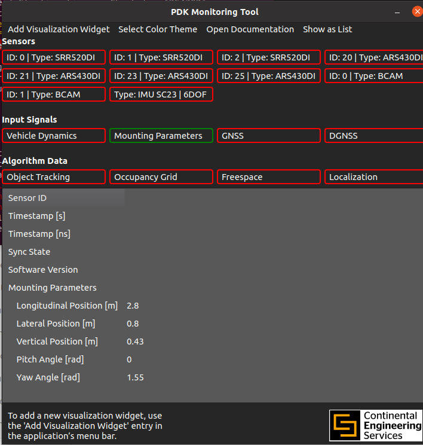

#### *This instruction manual helps the users to run Collision warning system in SOLIO provided the sensors are mounted and the  connections are made as mentioned [here](https://github.com/SamukthaV/Solio1_RadCam_fusion/tree/main/Hardware%20setup%20)*

##### Steps
1) To acquire data from Radar Front/Rear (depending upon the application) and Camera
2) Follow the steps based on the type of warning ([Front](#to-perform-forward-collision-warning-system)/[Rear](#to-perform-rear-collision-warning-system))

## Enabling Radar Acquisition system
The common steps carried out in enabling the radar involves:
1) Opening the Perception Development Kit(PDK)
```bash
cd /opt/pdk/bin
./pdk_start.sh
```
#### *The Long range radar ARS430DI will be automatically enabled when we run the above command.Inorder to receive data from Short range radar run the below commands*
CAN0 is the communication channel for the left Short range RADAR and CAN1 for the Right Short range RADAR mounted on the vehicle.If requested for password provide the admin password of the system.
```bash
sudo ip link set can0 up type can bitrate 500000 dbitrate 2000000 fd on
sudo ip link set can1 up type can bitrate 500000 dbitrate 2000000 fd on

```
The following is the reference image for pdk.

 


## To perform Forward Collision Warning System
1. Run the python file [publishing front camera data](https://github.com/SamukthaV/Solio1_RadCam_fusion/blob/main/Collision%20warning%20based%20on%20Sensor%20fusion/FCWS%20%2B%20cut-in%20%2B%20cut-out/front_cam_pub.py)
```bash
source fusion/bin/activate
python3 front_cam_pub.py
```
3. Source the radar functions by running the following command
   ```bash
   source /home/orin/Downloads/radar_ros/src/conti_radar/_build/devel/setup.bash

    ```
4.  Run the python file [fusing front radar and camera data](https://github.com/SamukthaV/Solio1_RadCam_fusion/blob/main/Collision%20warning%20based%20on%20Sensor%20fusion/FCWS%20%2B%20cut-in%20%2B%20cut-out/front_radcam_fusion.py)
```bash
source fusion/bin/activate
python3 front_radcam_fusion.py
```
6. To integrate all the commands from SRR of both the sides and LRR of front and rear [integrated vehicle commands](https://github.com/SamukthaV/Solio1_RadCam_fusion/blob/main/Collision%20warning%20based%20on%20Sensor%20fusion/FCWS%20%2B%20cut-in%20%2B%20cut-out/integrate%20sensor%20commands.py)
```bash
python3 integrate_sensor_commands.py
```
## To perform Rear Collision Warning System
1. Run the python file [publishing front camera data](https://github.com/SamukthaV/Solio1_RadCam_fusion/blob/main/Collision%20warning%20based%20on%20Sensor%20fusion/FCWS%20%2B%20cut-in%20%2B%20cut-out/front_cam_pub.py)
```bash
source fusion/bin/activate
python3 front_cam_pub.py
```
3. Source the radar functions by running the following command
   ```bash
   source /home/orin/Downloads/radar_ros/src/conti_radar/_build/devel/setup.bash

    ```
4.  Run the python file [fusing front radar and camera data](https://github.com/SamukthaV/Solio1_RadCam_fusion/blob/main/Collision%20warning%20based%20on%20Sensor%20fusion/FCWS%20%2B%20cut-in%20%2B%20cut-out/front_radcam_fusion.py)
```bash
source fusion/bin/activate
python3 front_radcam_fusion.py
```
6. To integrate all the commands from SRR of both the sides and LRR of front and rear [integrated vehicle commands](https://github.com/SamukthaV/Solio1_RadCam_fusion/blob/main/Collision%20warning%20based%20on%20Sensor%20fusion/FCWS%20%2B%20cut-in%20%2B%20cut-out/integrate%20sensor%20commands.py)
```bash
python3 integrate_sensor_commands.py
```
